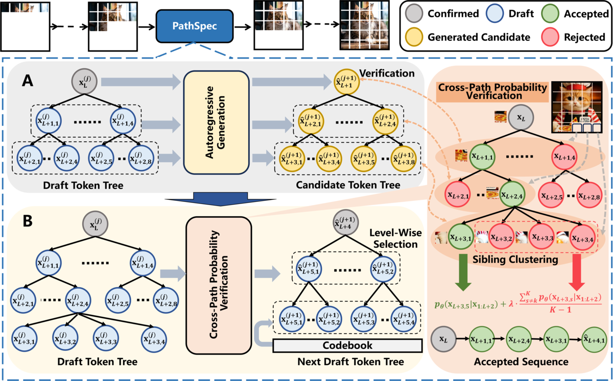

# [PathRelax: Parallel-Path Relaxed Speculative Jacobi Decoding for Accelerating Auto-Regressive Text-to-Image Generation](https://arxiv.org/abs/2606.10492)

[PathRelax: Parallel-Path Relaxed Speculative Jacobi Decoding for Accelerating Auto-Regressive Text-to-Image Generation](https://arxiv.org/abs/2606.10492)

<p align="center">
  <a href="./assets/main.pdf"></a>
</p>

<p align="center">
  <a href="./README.md"></a>
  <a href="https://arxiv.org/abs/2606.10492"></a>
</p>

本目录提供使用 `speculative_jacobi` 设置和静态分组树 (`Grouped_Tree_2`) 运行全数据集 PathSpec 评估的脚本。

## 环境配置

推荐环境：

- Python 3.10
- CUDA 12.5
- PyTorch 2.5.1+cu124
- Transformers 4.47.1

从 YAML 文件创建环境：

```bash
conda env create -f environment.yaml
```

## 完整基准测试评估脚本

主要测试入口为以下三个脚本：

- `script/mscoco2017_pathspec.sh`
- `script/pp_pathspec.sh`
- `script/t2i_pathspec.sh`

运行任何脚本前，请将脚本中的 `output_path` 设置为你的结果目录。

### 1) MSCOCO2017

脚本: `script/mscoco2017_pathspec.sh`

```bash
bash script/mscoco2017_pathspec.sh
```

默认基准测试设置：

- `prompt="MSCOCO2017Val"`
- `num_images=4000`
- `slice='1759-4000'`

### 2) PartiPrompts

脚本: `script/pp_pathspec.sh`

```bash
bash script/pp_pathspec.sh
```

默认基准测试设置：

- `prompt="PartiPrompts"`
- `num_images=1600`
- `slice='1370-1600'`

### 3) T2ICompBench

脚本: `script/t2i_pathspec.sh`

```bash
bash script/t2i_pathspec.sh
```

默认基准测试设置：

- `prompt="T2ICompBenchVal"`
- `num_images=2400`
- `slice='0-2400'`

## 注意事项

- `mscoco2017_pathspec.sh` 使用 `../main.py`。
- `pp_pathspec.sh` 和 `t2i_pathspec.sh` 使用 `main.py` 的绝对路径。如果你的本地目录结构不同，请更新路径。
- 脚本配置参数：
  - `isp='random'`
  - `method='speculative_jacobi'`
  - `num_init_new_token=16`
  - `benchmark_way='order'`
  - `--static_tree --tree_choices=Grouped_Tree_2`

## Star History

<a href="https://www.star-history.com/?repos=Haodong-Lei-Ray%2FPathSpec&type=date&legend=top-left">
 <picture>
   <source media="(prefers-color-scheme: dark)" srcset="https://api.star-history.com/chart?repos=Haodong-Lei-Ray/PathSpec&type=date&theme=dark&legend=top-left" />
   <source media="(prefers-color-scheme: light)" srcset="https://api.star-history.com/chart?repos=Haodong-Lei-Ray/PathSpec&type=date&legend=top-left" />
   
 </picture>
</a>

## 引用

如果你使用了本代码库，或认为我们的工作有价值，请引用：

```bibtex
@misc{lei2026pathrelaxparallelpathrelaxedspeculative,
      title={PathRelax: Parallel-Path Relaxed Speculative Jacobi Decoding for Accelerating Auto-Regressive Text-to-Image Generation}, 
      author={Haodong Lei and Hongsong Wang and Bingxuan Dai and Pan Zhou},
      year={2026},
      eprint={2606.10492},
      archivePrefix={arXiv},
      primaryClass={cs.CV},
      url={https://arxiv.org/abs/2606.10492}, 
}
```
